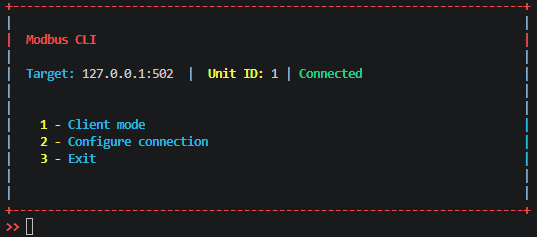
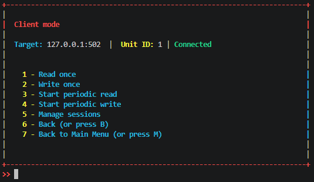
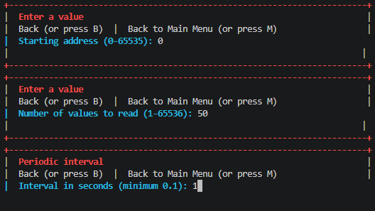
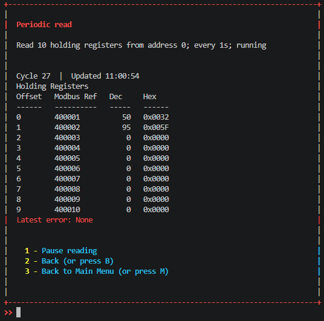
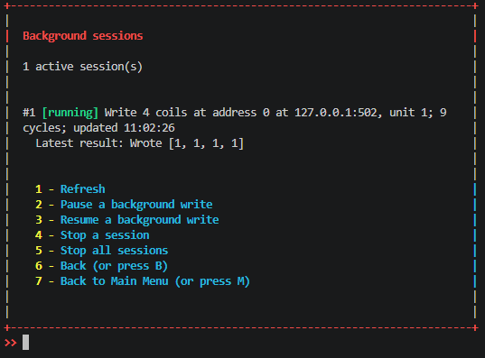

# Modbus CLI

An interactive Modbus TCP client for reading and writing coils and registers.

## Dependencies

- Python 3.10 or later
- `console-menu` 0.8.x
- `pymodbus` 3.x

Dependencies are installed automatically with the package.

## Implemented Features

The Modbus CLI supports the most commonly used Modbus functions for reading and writing standard Modbus data types. Addressing can be specified using the standard Modbus reference prefixes:

- **0x** - Coils
- **1x** - Discrete Inputs
- **3x** - Input Registers
- **4x** - Holding Registers

### Supported Modbus Functions

| Function Code | Name | Description |
|--------------|------|-------------|
| 0x01 | Read Coils | Read one or more coils (0x) |
| 0x02 | Read Discrete Inputs | Read one or more discrete inputs (1x) |
| 0x03 | Read Holding Registers | Read one or more holding registers (4x) |
| 0x04 | Read Input Registers | Read one or more input registers (3x) |
| 0x05 | Write Single Coil | Write a single coil (0x) |
| 0x06 | Write Single Register | Write a single holding register (4x) |
| 0x0F | Write Multiple Coils | Write multiple coils (0x) |
| 0x10 | Write Multiple Registers | Write multiple holding registers (4x) |

### Concurrent Sessions

The tool supports running multiple Modbus sessions in parallel. This allows different operations to execute simultaneously, for example:

- Continuously writing to a coil
- Monitoring coil values from another session to observe state changes in real time.
- Running independent read and write operations against the same or different devices.
 
This makes it possible to simulate device behavior, test automation logic, and monitor changes without interrupting other active sessions.

## Screenshots 

 

 

 

 


## Run

From the source tree using virtual envs:

```powershell
python3 -m venv .venv
source .venv/bin/activate
pip3 install -r requirements.txt
python3 -m modbuscli
```

The default connection is `127.0.0.1:502`, Unit ID `1`. Change it in the
Configure connection menu.


## To Do
- Scanning for active mobbus unit IDs 
- Scanning for modbus devices on the network